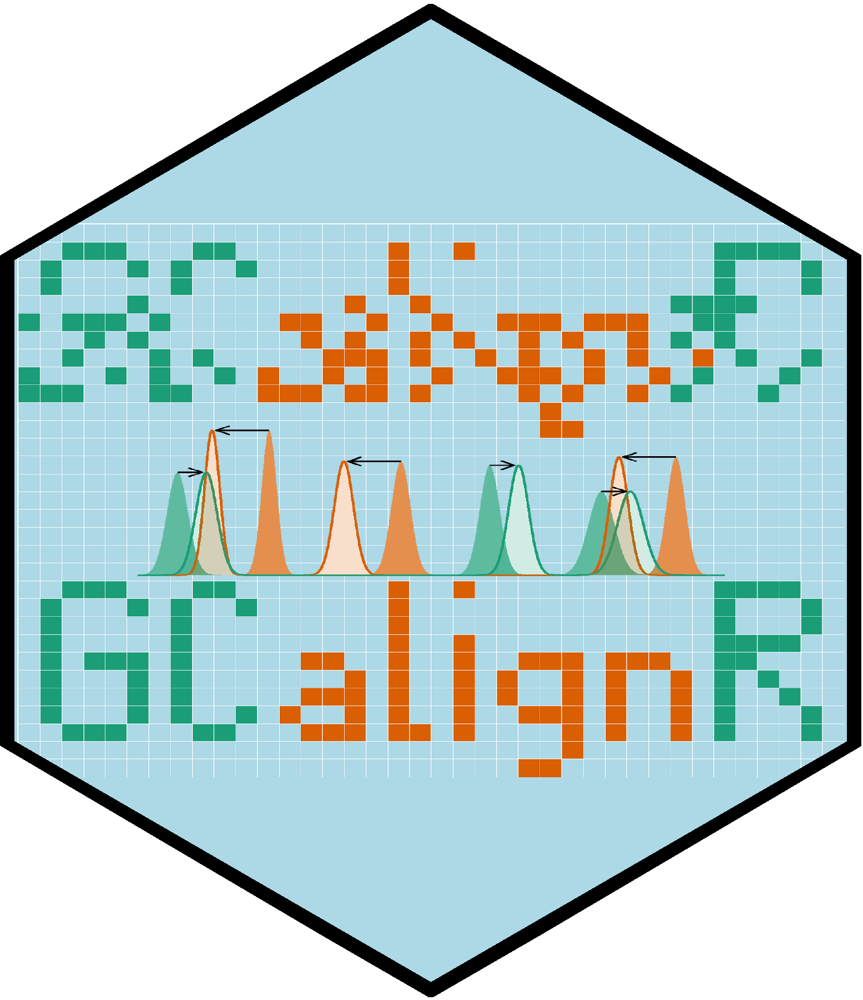

<!-- README.md is generated from README.Rmd. Please edit that file -->

```{r, echo = FALSE}
knitr::opts_chunk$set(
  collapse = TRUE,
  comment = "#>",
  fig.path = "README-"
)
```

# GCalignR  [](https://github.com/mottensmann/GCalignR)


[](https://cran.r-project.org/package=GCalignR)
[](https://cran.r-project.org/package=GCalignR)
`r badger::badge_doi("10.1371/journal.pone.0198311", "Darkorange")`
`r badger::badge_altmetric("43624695", "Darkorange")`

`GCalignR` provides simple functions to align peak lists obtained from Gas Chromatography Flame Ionization Detectors (GC-FID) based on retention times and plots to evaluate the quality of the alignment. The package supports any other one-dimensional chromatograpy technique that enables the user to create a peak list with at least one column specifying retention times as illustrated below.

```{r, fig.align='center', fig.height=6, fig.asp=1, echo=FALSE}
knitr::include_graphics(path = "vignettes/Two_Chromas_Peak_List.png", dpi = 300)
```

As with other software you need to get used to the input format which is shown in the illustration:

* Row 1: Sample names
* Row 2: Variable names
* Row 3-N: GC data
    + Each block belongs to a sample as shown for sample A (green) and sample B (orange) above

### Installing GCalignR:

* Get the latest version 1.0.3 on `GitHub`

*The most recent version on GitHub introduces the new parameter `remove_empty` within the `align_chromatograms` function. This parameter allows to remove empty samples (i.e. no peak is left after the processing) from the dataset. Otherwise issues with downstream analyses might occur*

```{r, eval=FALSE}
    if (!("devtools" %in% rownames(installed.packages()))) { 
    install.packages("devtools")
    } else if (packageVersion("devtools") < 1.6) {
    install.packages("devtools")
    }
    devtools::install_github("mottensmann/GCalignR@v1.0.3", build_vignettes = TRUE)
```

* The current release 1.0.2 is on `CRAN.`

```{r, eval = FALSE}
install.packages("GCalignR", dependencies = T)
```


### Get started with GCalignR

To get started read the vignettes:  

```{r, eval = FALSE}
browseVignettes("GCalignR")
```

If you encounter bugs or if you have any suggestions for improvement (for instance on how to speed up the algorithm!), just contact meinolf.ottensmann[at]web.de

*Also I´m happy to provide help if you can´t get it to work. Usually it is easy to solve small problems. However, in order to simplify this process please send a short description of the problem along with the code you have been using as a script file (.R) together with a minimal example input file (.txt).* 

### Reference

[Ottensmann M, Stoffel MA, Nichols HJ, Hoffman JI (2018) GCalignR: An R package for aligning gas-chromatography data for ecological and evolutionary studies. PLoS ONE 13(6): e0198311. https://doi.org/10.1371/journal.pone.0198311](https://doi.org/10.1371/journal.pone.0198311)
